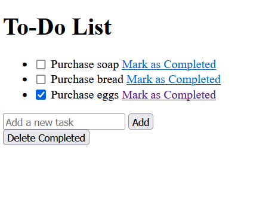

Django To-Do List Web App

  

## Table Of Content

- [Description](#description)
- [Deployed website link](#deployedWebsite)
- [Installation](#installation)
- [Usage](#usage)
- [Contributing](#contribution)
- [Tests](#tests)
- [GitHub](#github)
- [Contact](#contact)
- [License](#license)

  

## Description

  The Django To-Do List Web App is a simple web application built with Django and SQLite that allows users to create, manage, and organize their tasks and to-do items. It provides a user-friendly interface for adding new tasks, marking tasks as complete, and deleting tasks when they are no longer needed.

Deployed website: <strong><a href="http://blockchaincyberpunk1.github.io/code-commenter">http://blockchaincyberpunk1.github.io/django-todolist-v2</a></strong>

   
Django To-Do List

## Installation

Clone the repository:

git clone https://github.com/blockchaincyberpunk1/django-todolist-v2.git

Navigate to the project directory:

cd django-todolist-v2

Create a virtual environment (optional but recommended):

python -m venv venv
source venv/bin/activate  # On Windows, use: venv\Scripts\activate

Install project dependencies:

pip install -r requirements.txt

Run database migrations:

python manage.py migrate

Start the development server:

python manage.py runserver

Access the application in your web browser at http://localhost:8000.

Django To-Do List is built with the following tools and libraries: <ul><li>Django: Django is a high-level Python web framework used for building web applications. It provides features for routing, handling requests, managing databases, and more.</li> <li>SQLite: SQLite is a lightweight, serverless, and self-contained relational database management system. It is the default database used by Django for local development.</li> <li>HTML/CSS: HTML (Hypertext Markup Language) and CSS (Cascading Style Sheets) are fundamental technologies for creating the structure and styling of web pages.</li> <li>JavaScript: JavaScript is a programming language used for adding interactivity and functionality to web pages. In this project, JavaScript is likely used for frontend interactions and validation.</li></ul>

## Usage
 
Visit the web app at http://localhost:8000/.
Add new tasks by entering task descriptions and clicking the "Add" button.
Mark tasks as complete by checking the checkbox next to each task.
Delete tasks by clicking the "Delete Completed" button next to each task

## Contribution
 
Contributions to this project are welcome! If you would like to contribute, feel free to open issues, submit pull requests, or make suggestions for improvements.

## Tests
 
To run tests for the application, use the following command:
python manage.py test

## GitHub

<a href="https://github.com/blockchaincyberpunk1"><strong>blockchaincyberpunk1</a></strong>

Visit my website: <strong><a href="http://blockchaincyberpunk1.github.io/thepolyglot">The Polyglot</a></strong>

## Contact

Feel free to reach out to me on my email:
thepolyglot8@gmail.com

## License

